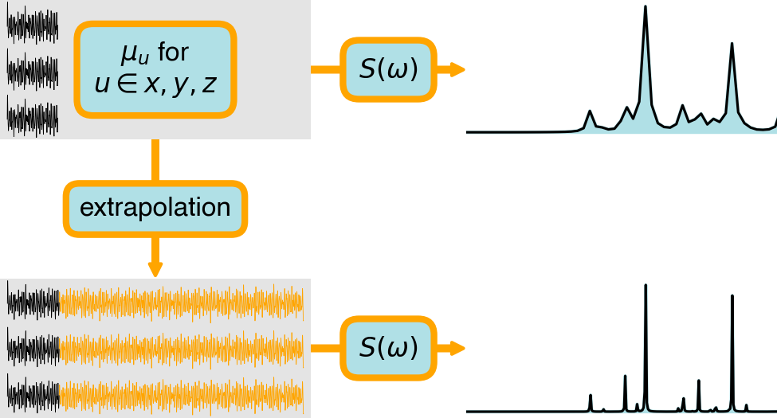

# Absorption spectra from real-time quantum calculations

This is the release repository of 

> Hauge, E.; Kristiansen, H. E.; Konecny, L.; Kadek, M.; Repisky, M.; Pedersen, T. B. Cost-Efficient High-Resolution Linear Absorption Spectra Through Extrapolating the Dipole Moment from Real-Time Time-Dependent Electronic-Structure Theory. J. Chem. Theory Comput., 2023, https://doi.org/10.1021/acs.jctc.3c00727


We refer to the [article](https://doi.org/10.1021/acs.jctc.3c00727) for details on the algorithm. 



The paper is also available on [arXiv](https://arxiv.org/abs/2307.01511). For an earlier version of the algorithm (using RT-TDCCSD data), see 
[Hauge's master thesis](https://www.duo.uio.no/handle/10852/91284).


## Environment set-up
Create a suitable conda environment by running the following command line in your terminal:
```
conda env create -f environment.yml
```
Activate the environment:
```
conda activate absorption-spectra
```